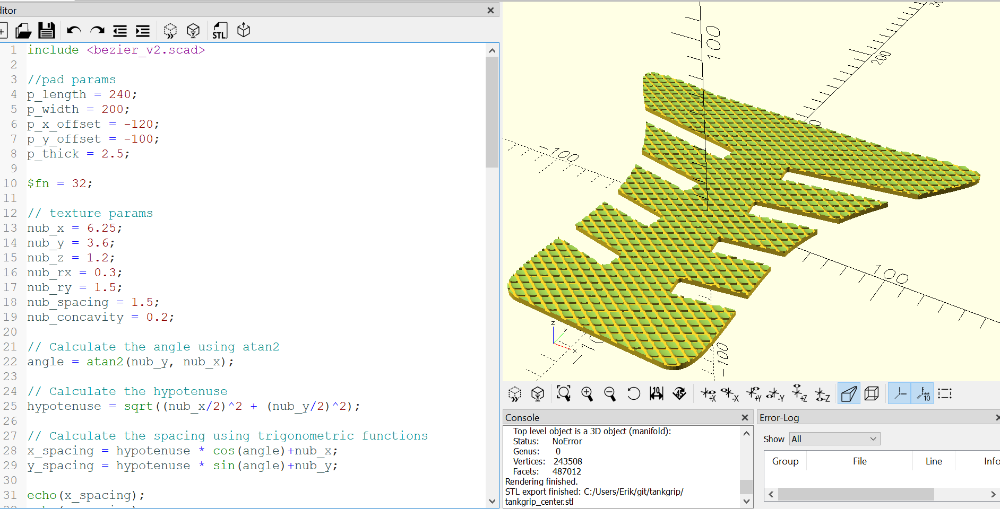

# Textured Motorcycle Tank Grips

This OpenSCAD script generates textured motorcycle tank grips that can be 3D printed.

## Parameters

The script has several parameters that can be adjusted to customize the grip pads

- `p_length`, `p_width`, `p_thick`: Dimensions of the grip pads. Length and width are used to define the area where the texture will be applied. 
- `p_x_offset`, `p_y_offset`: the grip texture area is not centered by default. Use these offsets to center it.
- `render_part`: Render the "center" or "sides" part. Can add additional part definitions for new shapes. 
- `nub_x`, `nub_y`, `nub_z`: Dimensions of the texture nubs. Default value attempts to replicate TechSpec scale pattern.
- `nub_rx`, `nub_ry`: Radii of nub edges. Can be NO MORE than HALF the dimension of the nub on that axis or things break.
- `nub_spacing`: Spacing between nubs. 
- `nub_concavity`: Concavity of nub tops for extra grippiness

## Configuring pad shapes 

The included padshape_*() modules use a matrix of points and control points to form a smooth-edged polygon from bezier curves. 

You can create your own padshape_*() module by copying one of the existing ones and modifying the bezier matrix, or, if you prefer, simply defining any other 2 dimensional shape for your pad.

Modify the padshape() module to render a part using your padshape.

## Texture

The grips are textured with an array of rounded rectangular nubs. The nub size, shape, and spacing can be adjusted with the `nub_` parameters.

The texture is generated procedurally and intersected with the base pad shapes.

## Included Libraries

- [bezier_v2.scad](https://github.com/openscad/openscad/blob/master/libraries/bezier_v2.scad): For generating bezier curves and polygons

## Printing

Print using TPU or other flexible filament. Print flat or with angled/nonplanar slicing for better surface texture resolution. 

Recommended print settings:
- Layer height: 0.1mm
- Infill: 100%  
- Perimeters: 3

